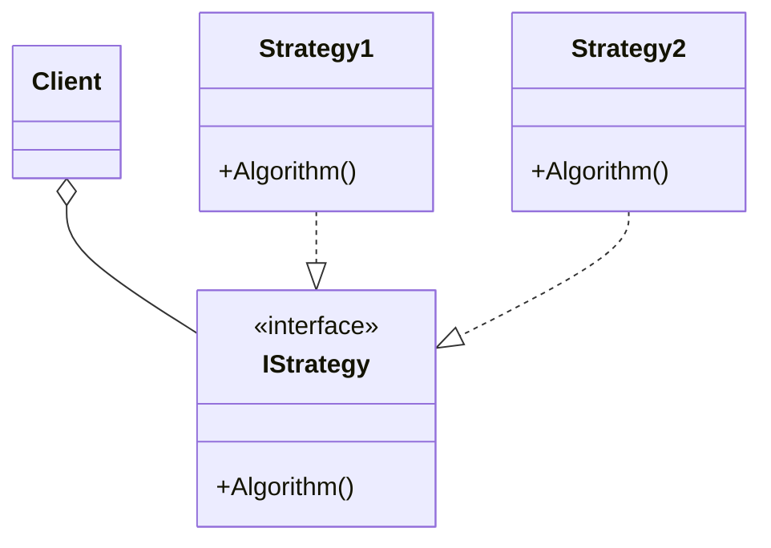
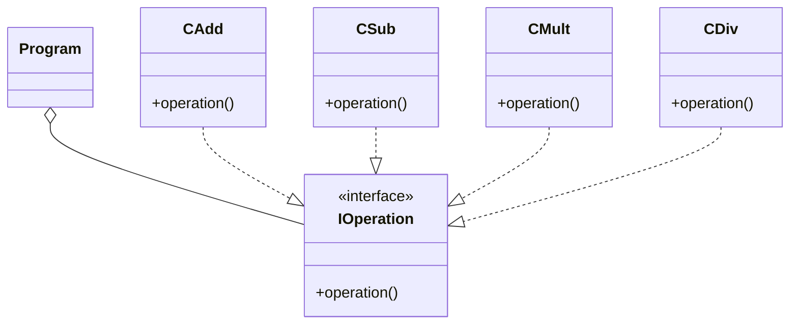

# Strategy
 - It is built with different encapsulated algorithms.
 - The client selects the algorithm to use.
 - It can be implemented using inheritance or implementing interfaces.

## UML Diagram
### General

### For this example

