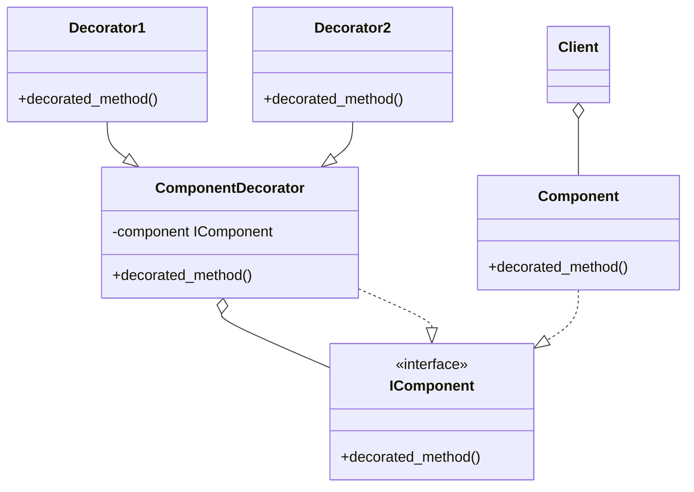
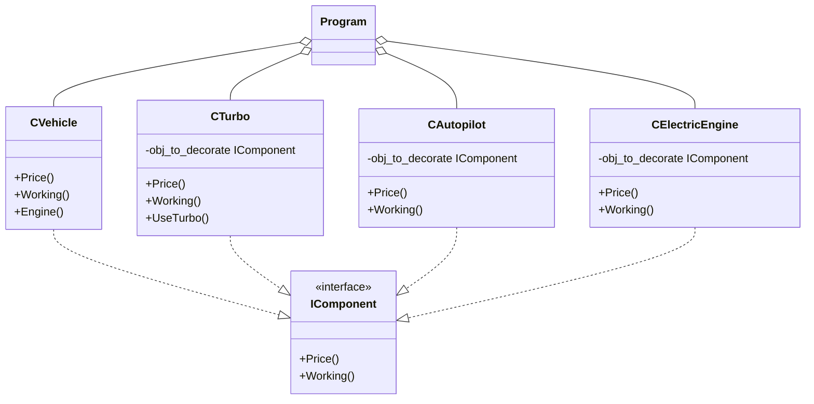

# Decorator
 - Add a new behaviour or state to an object in a dynamic way.
 - The object does not know it is being decorated.
 - Each decorator is independent of the rest of decorators.
 - The decorator has an instance of the original class and it descens of this class also.
 - It does not depend on the inheritance for adding new behaviours.

## UML Diagram
### General

### For this example

