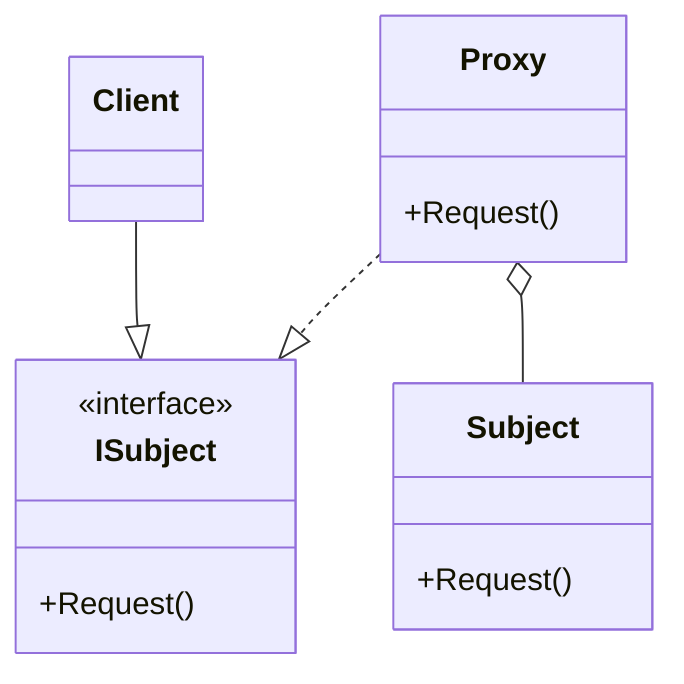
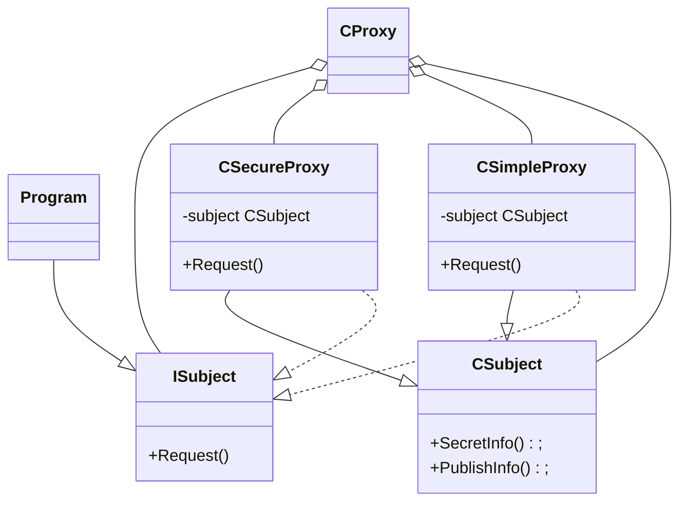

# Proxy
 - It used to control the creation and access to other objects.

## UML Diagram
### General

```mermaid
  classDiagram
    class Client
    class ISubject{
      <<interface>>
      +Request()
    }
    class Proxy{
      +Request()
    }
    class Subject{
      +Request()
    }
    Client --|> ISubject
    Proxy ..|> ISubject
    Proxy o-- Subject
```
### For this example

```mermaid
  classDiagram
    class Program
    class CProxy{
    }
    class ISubject{
      +Request()
    }
    class CSimpleProxy{
      -subject CSubject
      +Request()
    }
    class CSecureProxy{
      -subject CSubject
      +Request()
    }
    class CSubject{
      +SecretInfo();
      +PublishInfo();
    }
    Program --|> ISubject
    CProxy o-- CSubject
    CProxy o-- CSimpleProxy
    CProxy o-- CSecureProxy
    CProxy o-- ISubject
    CSimpleProxy ..|> ISubject
    CSimpleProxy --|> CSubject
    CSecureProxy ..|> ISubject
    CSecureProxy --|> CSubject
```
