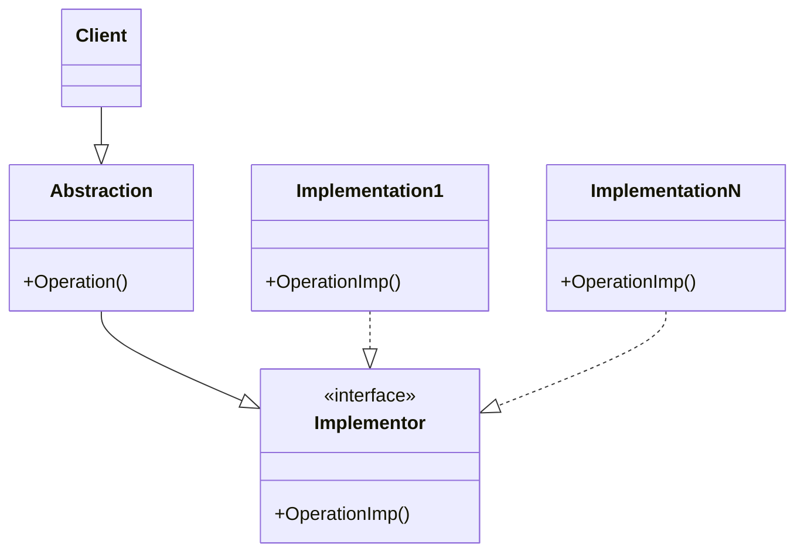
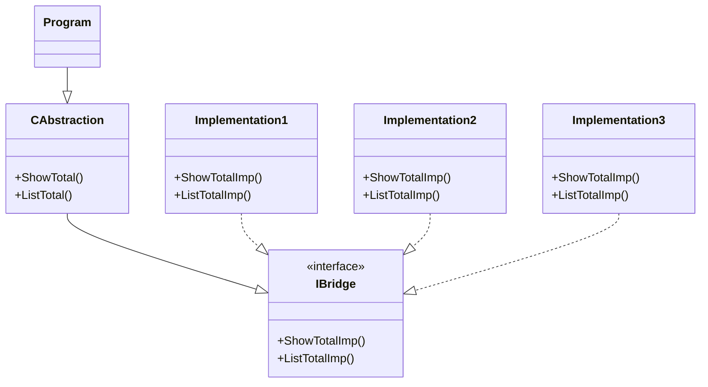

# Bridge
 - Disconnect implementation from abstraction.
 - The client chooses which version of implementation wants to use.
 - An interface is used to provide access to the implementations.

## UML Diagram
### General

### For this example

