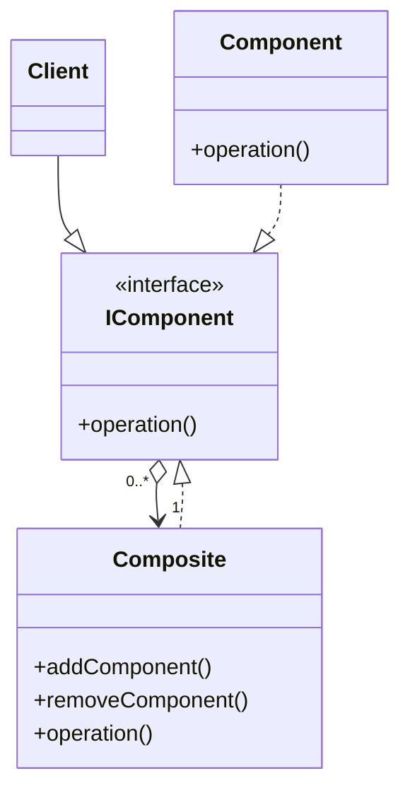
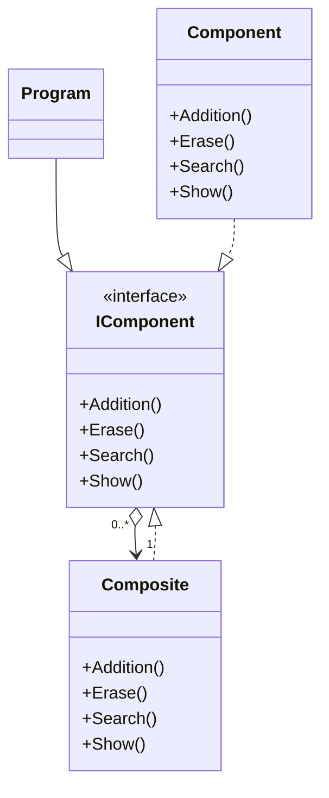

# Composite
 - It allows you to compose objects into a tree structure.
 - It describes a group of objects that is treated the same way as a single instance of the same type of object.
 - It should be used when the client needs to ignore the difference between compositions of objects and individual objects.

## UML Diagram
### General
- **IComponent** is the interface which defines the common operations for both the Composite and Component objects.
- **Composite** implements IComponent interface and embeds an array of child Components.
- **Component** is the primitive object in the tree. It also implements the IComponent Interface.
- **Client** manipulates the objects in the composition through the IComponent interface.

### For this example

