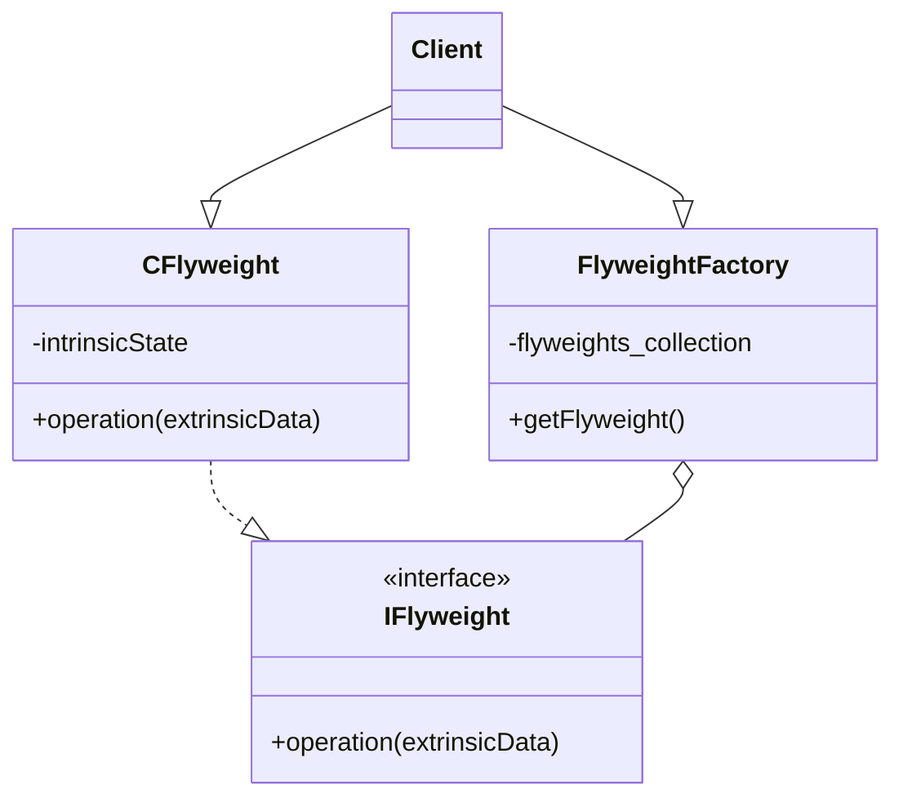
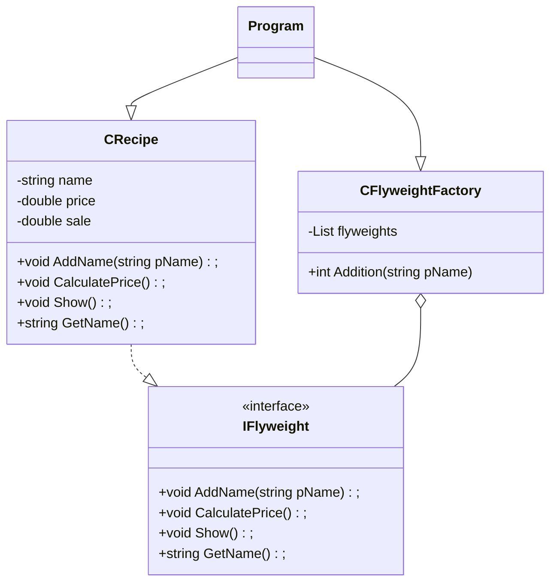

# Flyweight
 - It refers to an object that minimizes memory usage by sharing some of its data with other similar objects.
 - It allows you to save resources (RAM).
 - It should be used when there are a high number of similar objects.
 - It increases the CPU load.
 - The object has two states:
   - Intrinsic state: it is the invariable state, it can be shared.
   - Extrinsic state: it is the variant state, it can not be shared.

## UML Diagram
### General
- **CFlyweight** is which implements the IFlyweight and stores intrinsic state.
- **IFlyweight** is which takes in extrinsic state and performs an operation.
- **FlyweightFactory** is which creates and shares Flyweight objects.
- **Client** is the user of the pattern.

### For this example

