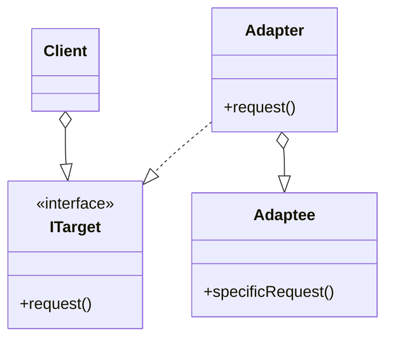
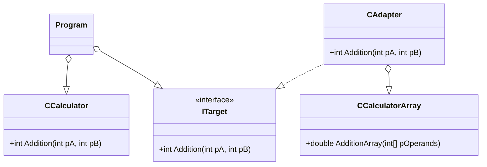

#  Adapter
 - It allows object with incompatible interfaces to communicate.
 - It converts the interface of one object so that another object can understand it.

## UML Diagram
### General
- **Client** is the user of the pattern. It can work with ITarget interface but not with Adaptee.
- **ITarget** is the interface used by the client.
- **Adaptee** is the class to be adapted, the client can not work directly with this class.
- **Adapter** adapts the Adaptee interface to ITarget interface.

### For this example

