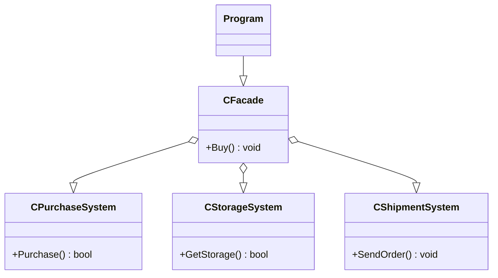

# Facade
 - It provides a simplified interface to a complex subsystem.
 - It can be used to provide a simpler interface, to order subsystems in layers or to decouple subsystems from the clients.

## UML Diagram
### General
- **Client** is the user of the pattern. It uses the simplified interface instead the interfaces provided by the subsystems.
- **Facade** is the class which simplifies the Subsystem usage to the Client.
- **Subsystem** is the end point, it performs an operation needed by the client.

### For this example

