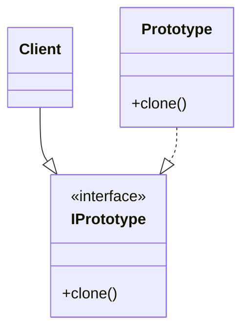
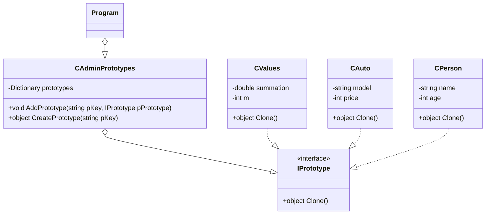

# Prototype
- It lets you copy existing objects without making your code dependent on their classes.
- It is used to avoid the inherent cost of creating a new object in the standard way when it is prohibitively expensive for a given application.
- This pattern delegates the cloning process to the actual objects that are being cloned.
- An interface contains just a single clone method

## UML Diagram
### General
- **Client** can produce a copy of any object which implements the IPrototype interface.
- **IPrototype** is the interface which declares the cloning method.
- **Prototype** implements the cloning method. It copies the original object’s data to the clone.

### For this example

