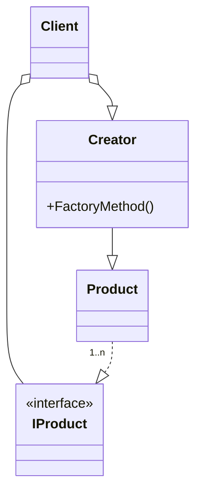
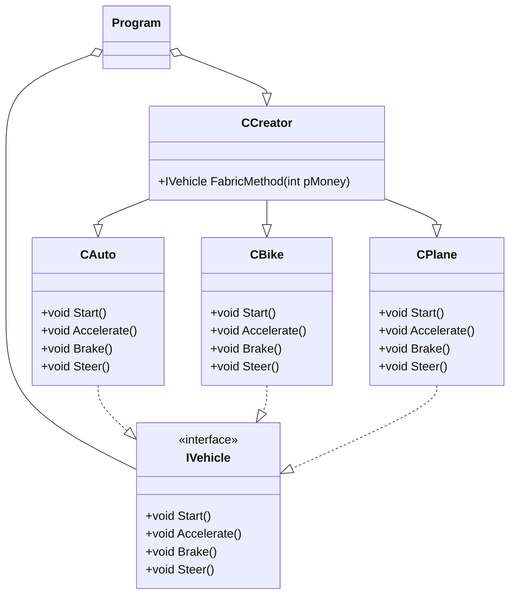

# Factory
- Decouple the creation of an object to the client.
- The creation of an object is done using a factory method.
- The decision of creating an object is not taken by the client.

## UML Diagram
### General
- **Client** is the user of the pattern, but it does not decide which product is created.
- **Creator** is the class which implements the method for creating the products.
- **IProduct** is the interface of the products.
- **Product** is the class used by the creator (produced by the factory).

### For this example

