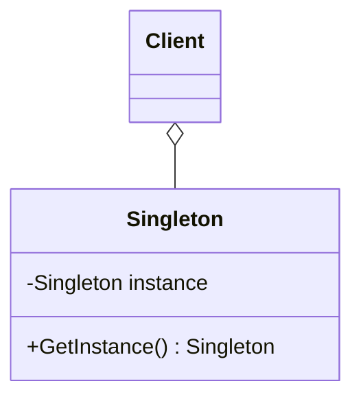
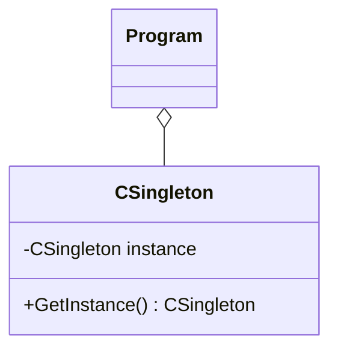

# Singleton
 - It is only possible to get one instance of the class.
 - It provides a global access point to the class.
 - It is useful for managing the access to unique resources.

## UML Diagram
### General
- **Client** is the user of the Singleton.
- **Singleton** is the class which you can only has one instance.

### For this example

