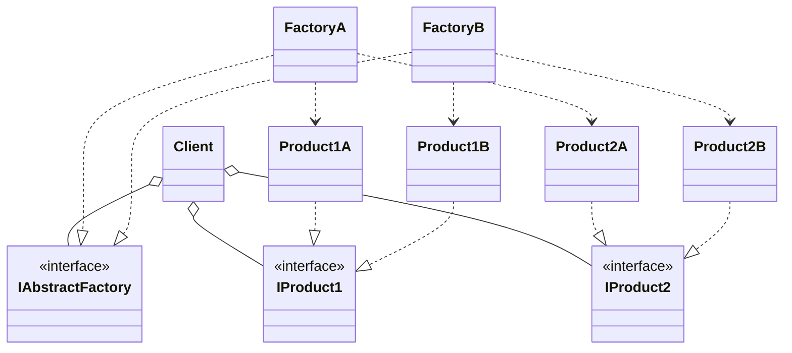
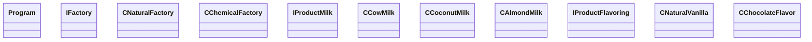

# Abstract Factory
 - It lets you produce families of related objects without specifying their concrete classes.
 - It provides a way to encapsulate a group of individual factories that have a common theme without specifying their concrete classes.

## UML Diagram
### General
- **Client** is the user of the pattern, it is only access to the created object through the abstract interfaces.
- **IAbstractFactory** is the interface for the Factory.
- **Factory** is the class which implements the interface of the abstract factory (IAbstractFactory).
- **IProduct** is the interface for the product created by the Factory.
- **Product** is the class which implement the interface IProduct, and the final object created by the Factory which is demanded by the Client.

### For this example

