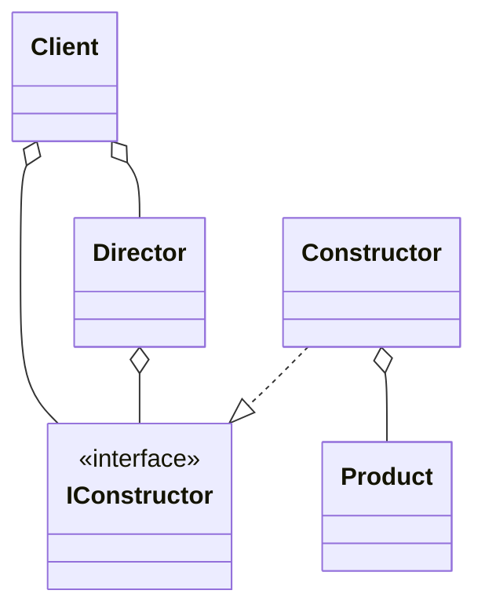
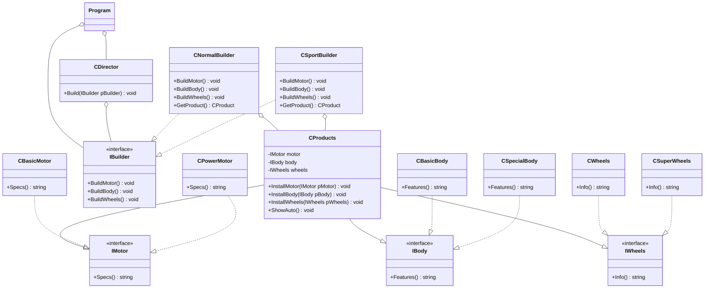

# Builder
 - It decouples the specificaton of an object of its constructor.
 - The same constructor process can creates different representations.
 - It is based on directors and constructors.
 - It is used for creating complex structures.
 - It is used when the algorithm used for creating the parts is independent of the parts itself.
 - It is useful when an accurate control of the construction process is required.

## UML Diagram
### General
- **Client** is the user of the pattern.
- **IConstructor** is the interface which defines what can be constructed.
- **Director** implements a sequence of operations to create a product.
- **Constructor** is invoked by the director to create the parts of the product.
- **Product** is the object under construction.

### For this example

