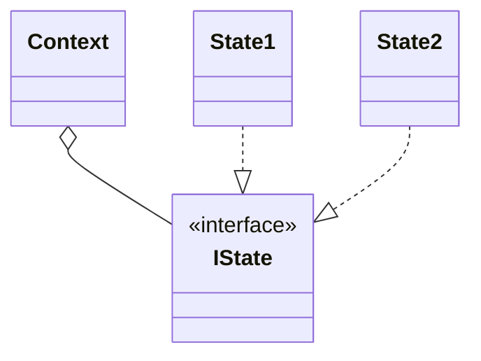
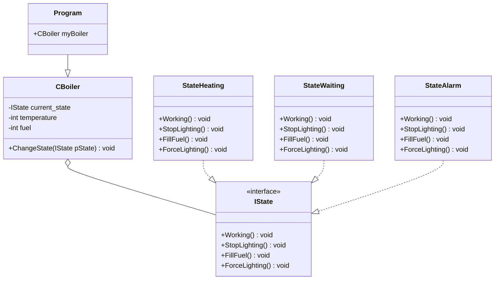

# State
 - It is a finite state machine implementation.
 - It is useful when you need to change the behaviour in execution time, according with the context.

## UML Diagram
### General
- **Context** it has the instance of the State and the interface.
- **IState** defines the interface for a particular state in the context.
- **State** is a class which implements a particular state.

### For this example

