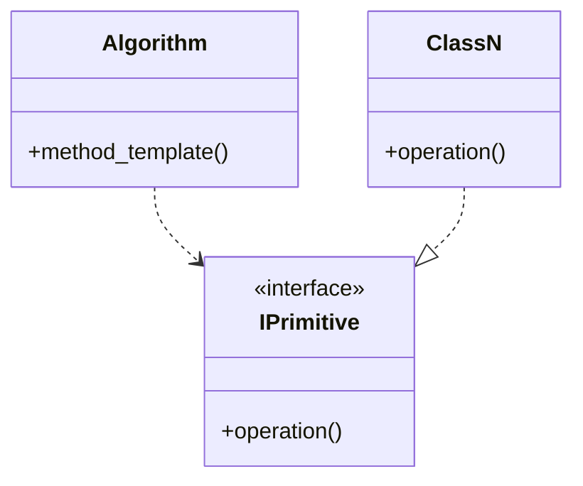
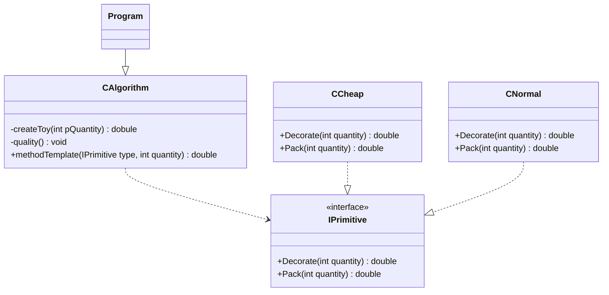

# Template
 - The steps of an algorithm can be executed by classes.
 - Some parts of the algorithm can be executed in other places.

## UML Diagram
### General
- **Algorithm** is the class which includes the template method.
- **IPrimitive** is the interface which defines the delegated operation.
- **ClassN** is the class that implements the interface IPrimitive.
- **method_template** is the method which defines some parts of the operation and delegates others to the classes.
- **operation()** is the method which is needed for finishing the operation.

### For this example

